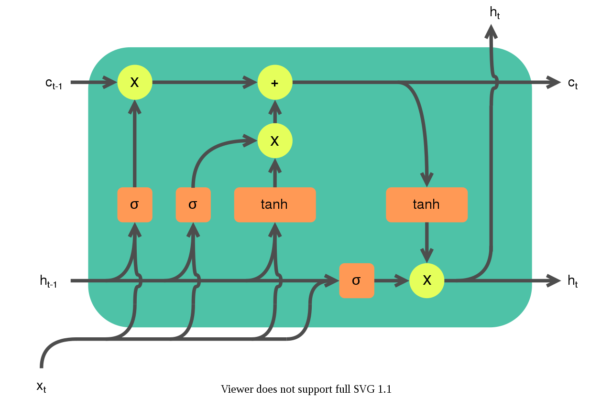
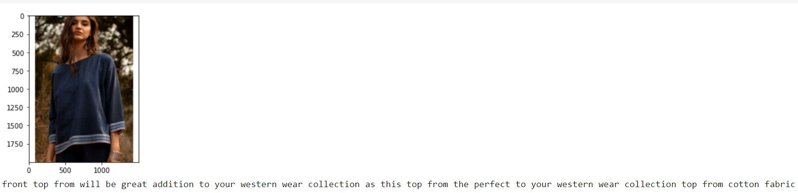

# Image_captioning_LSTM_CNN With Greedy_Search
Deep learning projects for IMAGE_captioning on fashion dataset

#Technology used in project
CONVENTIONAL NEUTRAL NETWORKS(CNN)
LONG SHORT TERM MEMORY (LSTM)
PANDAS
MATPLOTILIB
GOOGLE_COLAB
 #LSTM 
 Long short-term memory (LSTM) is an artificial recurrent neural network (RNN) architecture  used in the field of deep learning. Unlike standard feedforward neural networks, LSTM has feedback connections. It can not only process single data points (such as images), but also entire sequences of data (such as speech or video). For example, LSTM is applicable to tasks such as unsegmented, connected handwriting recognition, speech recognition  and anomaly detection in network traffic or IDSs (intrusion detection systems)
 

#I used pretrained cnn model  inception V3
Inception-v3 is a convolutional neural network architecture from the Inception family that makes several improvements including using Label Smoothing, Factorized 7 x 7 convolutions, and the use of an auxiliary classifer to propagate label information lower down the network (along with the use of batch normalization for layers in the sidehead)
#ARCHITECTURE OF INCEPTION V3 MODULE:
explanation of inception v3 
visit this youtube channel 
https://www.youtube.com/watch?v=ekixid21Q5U&t=618s

# greedy_search
greedy search use conditional probability P(X|Y) WHERE x IS INPUT WORDS OF SENTENCE Y IS OUTPUT WORD OF SENTENCE IT CHECKS EVERY WORDS PROBABILITY ARRANGAES IN SENETENCES
SO THIS SEARCH METHOD IS NOT OPTIMAL METHOD IT IS GOOD TO USE LESS SENETENCES

 #output of image captioning
 
 
 To understand basic lstm and gru 
 visit this link https://colah.github.io/posts/2015-08-Understanding-LSTMs/
 
 #images
https://drive.google.com/file/d/1Sif5TSVM-g7cLfHn156YaxixfpvZbiGl/view
 #textdata
https://drive.google.com/file/d/1Xe0q3oM_OGZoZ8J0gRKgKiJEulj-6a-G/view
